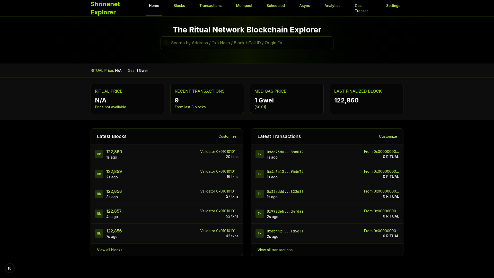
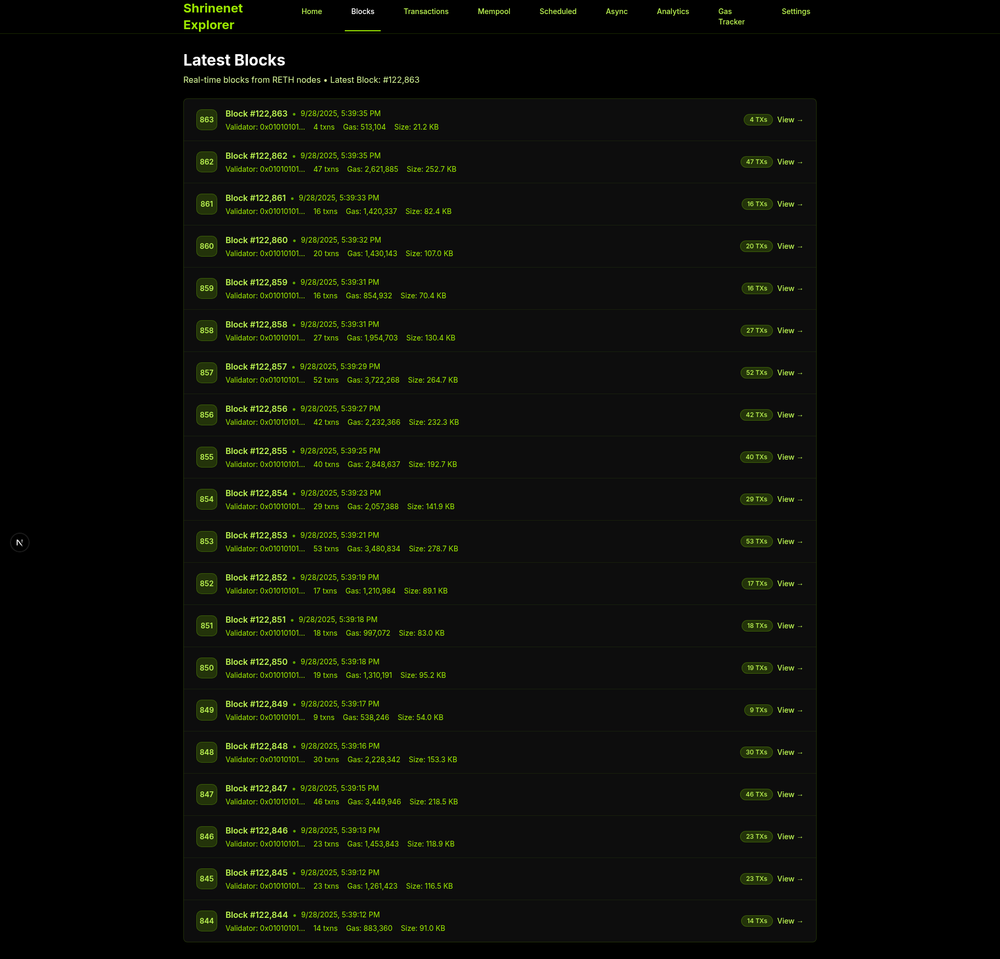
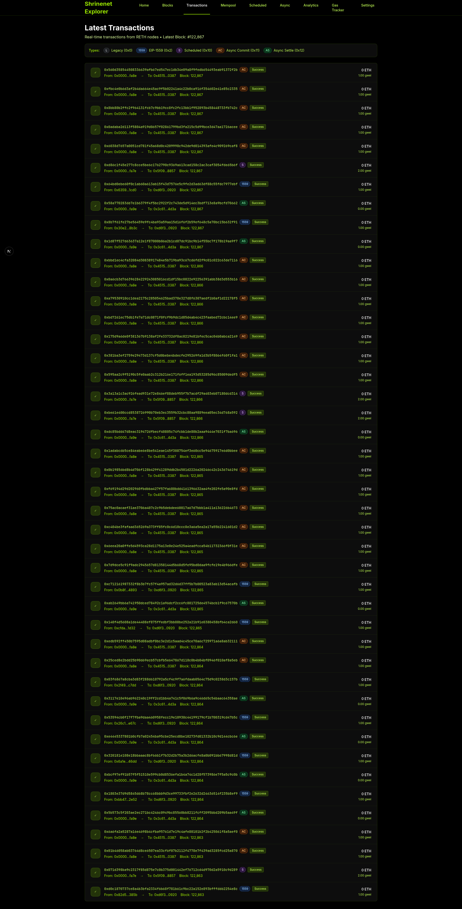
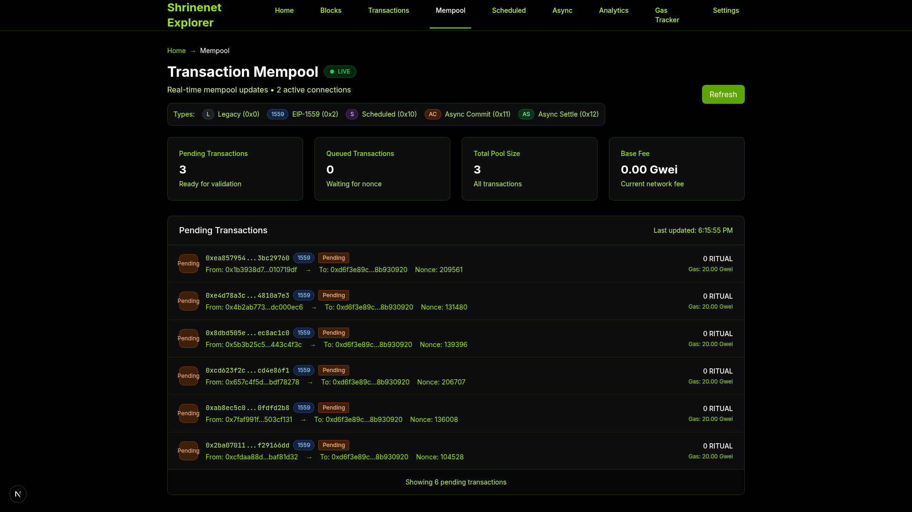
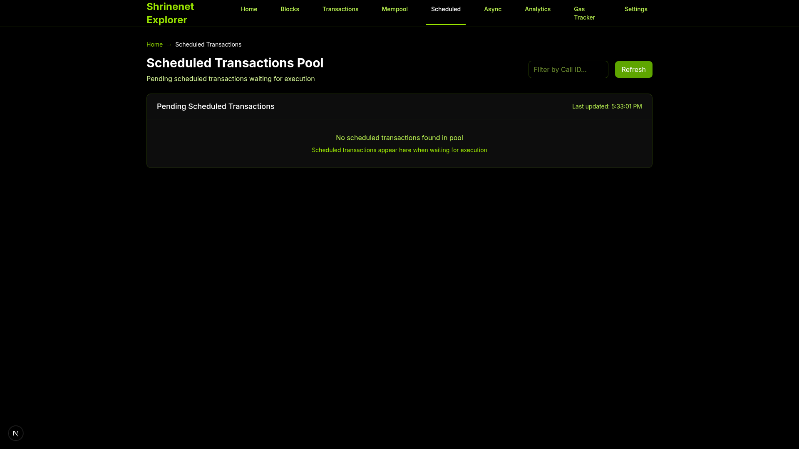
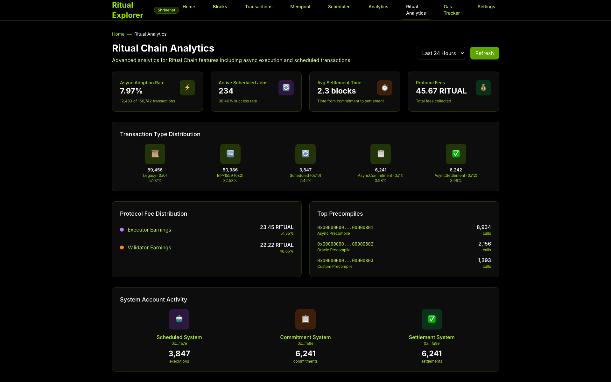
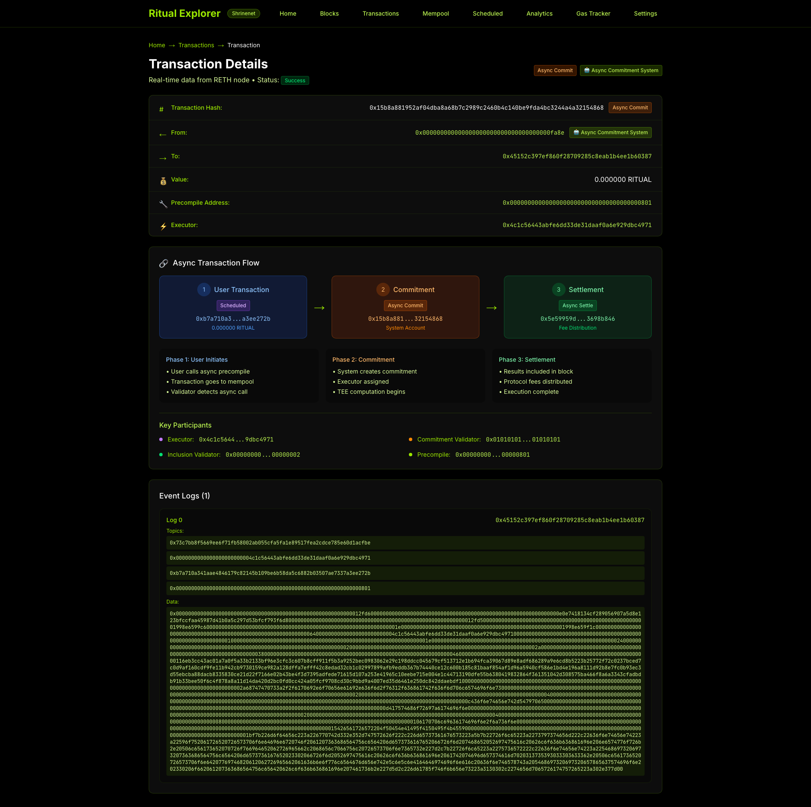
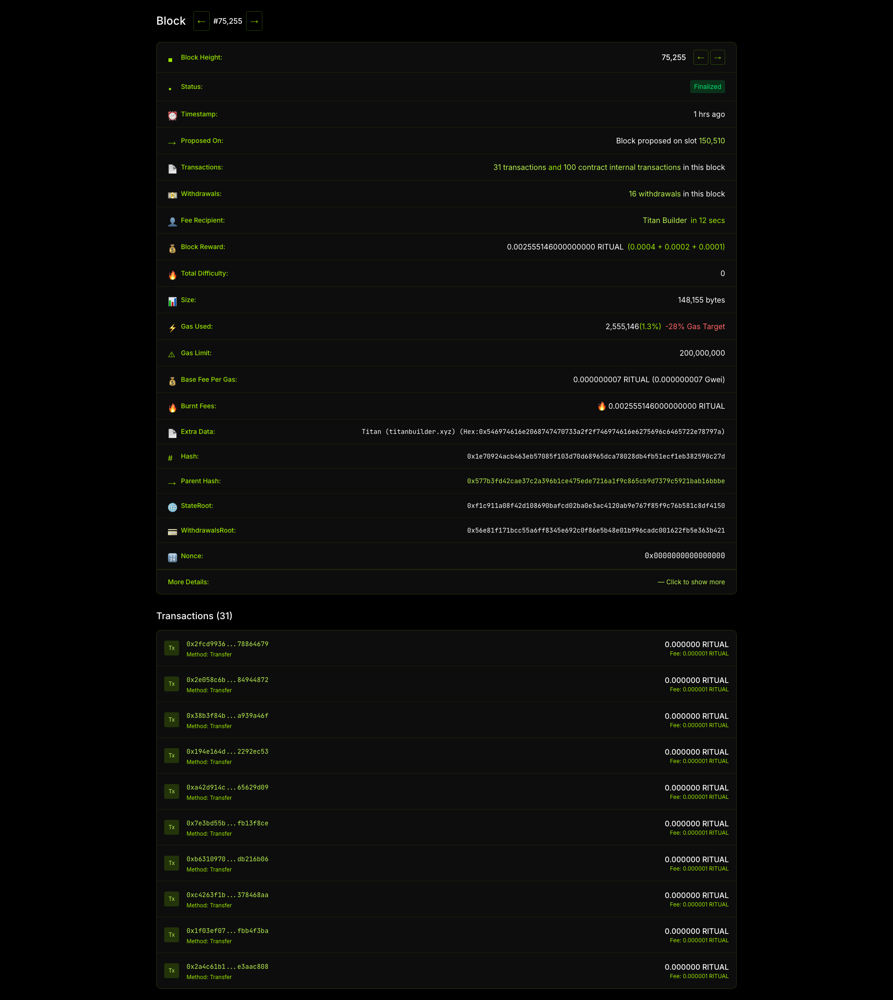
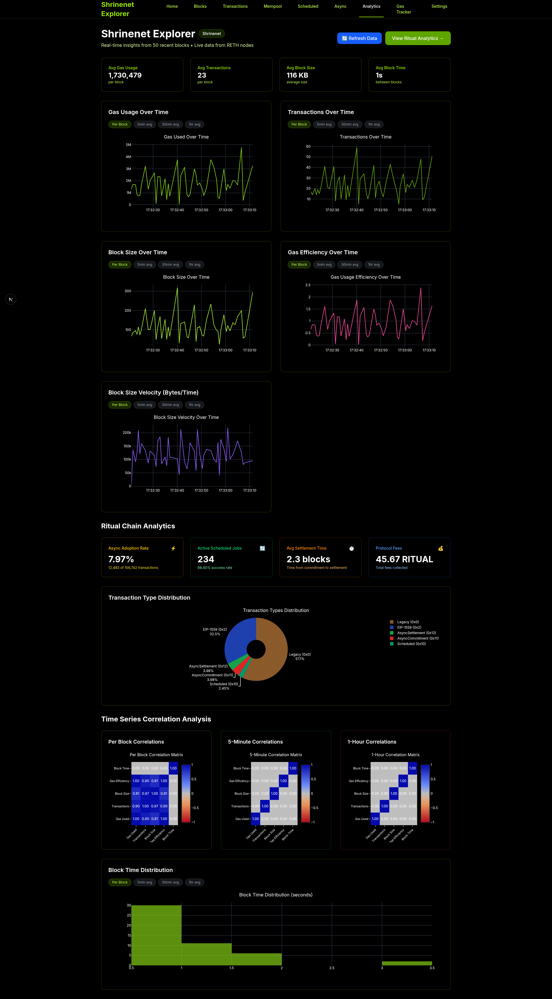

# Ritual Explorer - Advanced Blockchain Explorer


A production-ready, high-performance blockchain explorer built specifically for **Ritual Chain** with advanced features including async transaction visualization, scheduled job monitoring, and real-time WebSocket updates.

## 🌟 Key Features

### 🎯 **Ritual Chain Specific Features**
- **Async Transaction Flow Visualization** - Interactive diagrams showing 3-phase async execution
- **Scheduled Transaction Pool** - Real-time monitoring of cron-like blockchain jobs
- **System Account Recognition** - Special handling for Ritual system accounts (0x...fa7e, fa8e, fa9e)
- **Enhanced Transaction Types** - Support for Types 0x10 (Scheduled), 0x11 (AsyncCommitment), 0x12 (AsyncSettlement)
- **Advanced Search** - Call ID search, origin transaction linking, precompile address recognition

### ⚡ **High-Performance Real-Time Updates**
- **WebSocket Integration** - Direct connection to RETH nodes for instant updates
- **Multi-frequency Polling** - High-frequency mempool updates (2s), backup polling (5s)
- **Smart Reconnection** - Exponential backoff with jitter for resilient connections
- **Live Status Indicators** - Real-time connection status and subscriber count

### 📊 **Advanced Analytics**
- **Ritual Analytics Dashboard** - Async adoption metrics, protocol fee analysis
- **Transaction Type Distribution** - Visual breakdown of all 5 transaction types
- **System Account Activity** - Monitoring of automated vs user transactions
- **Precompile Usage Statistics** - Top async precompile contracts

## 🖼️ Screenshots


### Ritual Explorer Homepage



Main dashboard showing latest blocks, transactions, and network statistics


### Blocks Explorer



Real-time block explorer with detailed block information


### Transaction Explorer



Live transaction feed with Ritual Chain transaction types


### Real-time Mempool



Live mempool monitoring with WebSocket updates


### Scheduled Transactions



Ritual Chain scheduled transaction pool with Call ID filtering


### Ritual Chain Analytics



Advanced analytics for Ritual Chain features and adoption metrics


### Transaction Details with Async Flow



Enhanced transaction details showing async transaction relationships


### Block Details



Detailed block information with Etherscan-style layout


### Blockchain Analytics



General blockchain analytics with charts and metrics


## 🏗️ Architecture

### **Frontend Stack**
- **Next.js 14** with App Router and React Server Components
- **TypeScript** for complete type safety
- **Tailwind CSS** with lime/black Ritual theme
- **Real-time WebSocket** manager for live updates

### **Blockchain Integration**
- **Enhanced RETHClient** with Ritual-specific RPC methods
- **Multi-node Support** with fallback mechanisms  
- **Transaction Type Detection** for all 5 Ritual transaction types
- **System Account Recognition** and special handling

### **Real-Time Features**
- **WebSocket Manager** with automatic reconnection
- **React Hooks** for easy real-time integration
- **Update Throttling** and type filtering
- **Connection Status Monitoring**

## 🚀 Getting Started

### Prerequisites
- Node.js 18+ 
- Docker (optional)
- Access to Ritual Chain RETH nodes

### Installation

```bash
# Clone the repository
git clone <repository-url>
cd ritual-explorer

# Install dependencies
npm install

# Start development server
npm run dev

# Open browser to http://localhost:3000
```

### Docker Deployment

```bash
# Build and run with Docker
docker build -t ritual-explorer .
docker run -d -p 9000:3000 --name ritual-explorer ritual-explorer
```

## 🔧 Configuration

### Environment Variables

```env
# RPC Configuration
NEXT_PUBLIC_RPC_URL=http://35.185.40.237:8545
NEXT_PUBLIC_WS_URL=ws://35.185.40.237:8546

# Network Configuration  
NEXT_PUBLIC_NETWORK_NAME=Shrinenet
NEXT_PUBLIC_CURRENCY_SYMBOL=RITUAL
```

### Real-Time WebSocket

The explorer automatically connects to RETH WebSocket endpoints for:
- New block headers (`eth_subscribe` → `newHeads`)
- Pending transactions (`eth_subscribe` → `newPendingTransactions`)  
- Mempool updates (high-frequency polling)
- Scheduled transaction monitoring

## 🎨 Ritual Chain Features

### **Transaction Types Supported**

| Type | Description | System Account | Features |
|------|-------------|----------------|----------|
| 0x0 | Legacy | N/A | Standard Ethereum transactions |
| 0x2 | EIP-1559 | N/A | Enhanced gas mechanism |
| 0x10 | Scheduled | 0x...fa7e | Cron-like execution, Call ID tracking |
| 0x11 | AsyncCommitment | 0x...fa8e | TEE execution commitment |
| 0x12 | AsyncSettlement | 0x...fa9e | Final settlement with fee distribution |

### **Enhanced Search Patterns**

- `callId:10567` - Search scheduled transactions by Call ID
- `origin:0x...` - Find transactions by origin hash
- `10567` - Numeric Call ID search
- System account detection (fa7e, fa8e, fa9e)
- Precompile addresses (0x...0801, etc.)

## 📱 Pages & Features

### **Core Pages**
- **Homepage** - Network overview, latest blocks/transactions, stats
- **Blocks** - Real-time block explorer with detailed views  
- **Transactions** - Live transaction feed with type filtering
- **Mempool** - Real-time mempool monitoring with WebSocket updates

### **Ritual-Specific Pages**  
- **Scheduled** - Scheduled transaction pool with Call ID filtering
- **Ritual Analytics** - Advanced Ritual Chain metrics and adoption
- **Transaction Details** - Enhanced with async flow visualization
- **System Accounts** - Special pages for Ritual system addresses

## 🔗 Live Demo

**Production URL:** [Browser Preview Available](http://127.0.0.1:63901)

**Real-Time Features:**
- ✅ WebSocket connection to RETH nodes
- ✅ Live mempool updates every 2 seconds  
- ✅ New block notifications
- ✅ Scheduled transaction monitoring
- ✅ Connection status indicators

## 🛠️ Development

### **Project Structure**

```
src/
├── app/                    # Next.js App Router pages
│   ├── page.tsx           # Homepage
│   ├── blocks/            # Block explorer
│   ├── transactions/      # Transaction explorer  
│   ├── mempool/           # Real-time mempool
│   ├── scheduled/         # Scheduled transactions
│   ├── ritual-analytics/  # Ritual analytics
│   └── tx/[txHash]/       # Transaction details
├── components/            # Reusable components
│   ├── AsyncTransactionFlow.tsx    # Async flow visualization
│   ├── TransactionTypeBadge.tsx    # Type indicators
│   └── EnhancedTransactionDetails.tsx  # Enhanced details
├── hooks/                 # React hooks
│   └── useRealtime.ts     # Real-time WebSocket hooks
├── lib/                   # Core libraries
│   ├── reth-client.ts     # Enhanced RETHClient
│   └── realtime-websocket.ts  # WebSocket manager
└── styles/               # Tailwind CSS configuration
```

### **Key Components**

- **RETHClient** - Enhanced with Ritual-specific RPC methods
- **WebSocket Manager** - High-performance real-time updates
- **Transaction Flow** - Async relationship visualization  
- **System Recognition** - Ritual system account handling
- **Search Enhancement** - Call ID and precompile search

## 🔍 Testing

### **Automated Testing**

```bash
# Run component tests
npm test

# Generate screenshots  
npm run screenshots

# Test navigation flows
node test-navigation.js
```

### **Real-Time Testing**

The explorer includes extensive real-time testing:
- WebSocket connection monitoring
- Transaction type detection
- System account recognition  
- Async flow visualization
- Call ID search functionality

## 🤝 Contributing

1. Fork the repository
2. Create a feature branch (`git checkout -b feature/amazing-feature`)
3. Commit changes (`git commit -m 'Add amazing feature'`)
4. Push to branch (`git push origin feature/amazing-feature`)  
5. Open a Pull Request

## 📄 License

This project is licensed under the MIT License - see the [LICENSE](LICENSE) file for details.

## 🙏 Acknowledgments

- **Ritual Network** for the innovative async execution model
- **RETH** for high-performance Ethereum execution
- **Next.js Team** for the excellent React framework
- **Etherscan** for UI/UX inspiration

---

<div align="center">
  <strong>Built with ❤️ for the Ritual Network ecosystem</strong>
</div>
