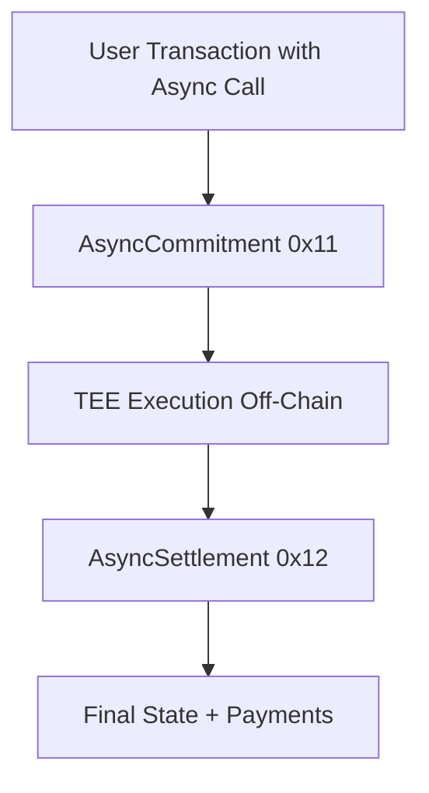
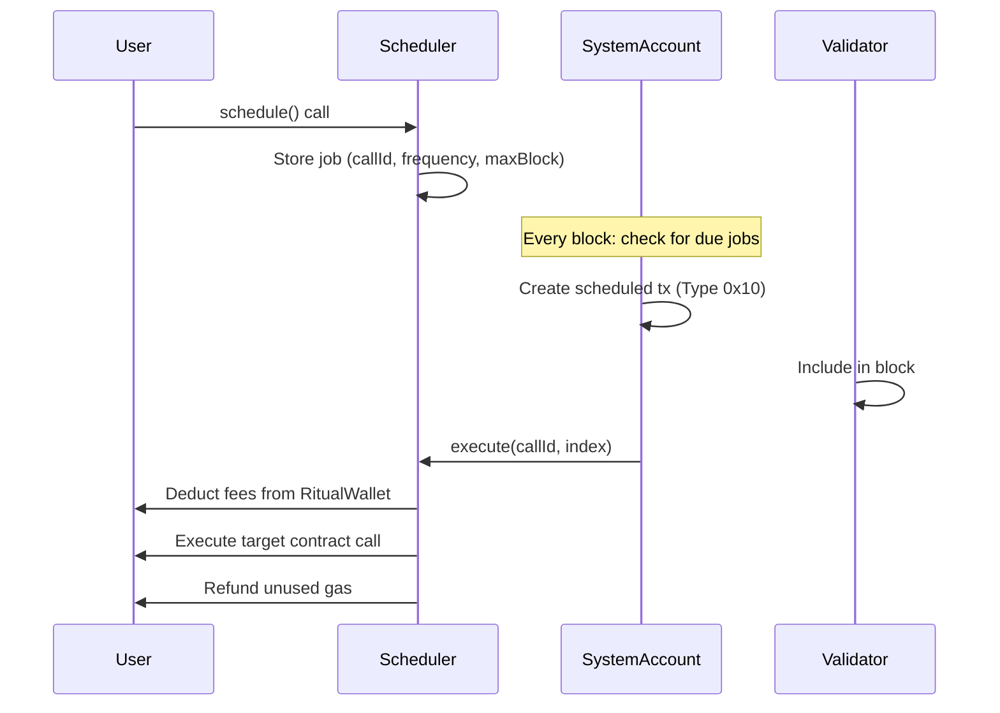

# Ritual Chain Knowledge Graph & Integration Analysis

## Executive Summary

Ritual Chain is an EVM-compatible blockchain that extends standard Ethereum functionality with **3 new transaction types** and **asynchronous execution capabilities**. This document maps all Ritual-specific features and their implications for blockchain explorers.

---

## 1. Core Architecture Overview

### 1.1 EVM Compatibility Matrix
-  **Standard Features**: All standard Ethereum RPCs, blocks, transactions, receipts, logs
-  **Enhanced Features**: 3 new transaction types + async execution
-  **Finality Model**: BFT instant finality (no reorg handling needed)

### 1.2 Key Differentiators from Standard EVM
```
Standard Ethereum: User Tx → Block → Receipt
Ritual Chain: User Tx → AsyncCommitment → AsyncSettlement (3-phase)
             OR: User Tx → Scheduled Pool → Recurring Execution
```

---

## 2. Transaction Type Taxonomy

### 2.1 Standard Transaction Types (Inherited)
- **Type 0x00**: Legacy transactions
- **Type 0x02**: EIP-1559 transactions

### 2.2 NEW: Ritual System Transaction Types
- **Type 0x10**: Scheduled (cron-like execution)
- **Type 0x11**: AsyncCommitment (async computation commitment)  
- **Type 0x12**: AsyncSettlement (async payment distribution)

### 2.3 System Sender Addresses (Balance-Exempt)
```
Scheduled:       0x000000000000000000000000000000000000fa7e
AsyncCommitment: 0x000000000000000000000000000000000000fa8e  
AsyncSettlement: 0x000000000000000000000000000000000000fa9e
```

---

## 3. Async Execution Flow (3-Transaction Pattern)

### 3.1 Flow Architecture


### 3.2 Transaction Relationships
- **User Tx** links to **AsyncCommitment** via `commitmentTx` field
- **User Tx** links to **AsyncSettlement** via `settlementTx` field  
- **AsyncCommitment** links to **User Tx** via `originTx` field
- **AsyncSettlement** links to **AsyncCommitment** via `commitmentTx` field

### 3.3 Enhanced User Transaction Schema (Async-Aware)
```json
{
  "type": "0x0|0x2",
  "commitmentTx": "bytes32",      // NEW: Links to AsyncCommitment
  "settlementTx": "bytes32",       // NEW: Links to AsyncSettlement  
  "spcCalls": [                    // NEW: Special precompile call records
    {
      "address": "address",        // Precompile contract address
      "input": "hex_bytes",        // Input to precompile
      "output": "hex_bytes",       // Output from precompile
      "proof": "hex_bytes",        // Cryptographic proof
      "blockNumber": "uint64",     // Block of precompile call
      "programCounter": "uint64",  // EVM PC location
      "callerAddress": "address"   // Contract that made call
    }
  ]
}
```

---

## 4. Scheduled Execution System

### 4.1 Scheduled Transaction Flow


### 4.2 Scheduled Transaction Schema
```json
{
  "type": "0x10",
  "originTx": "bytes32",           // Original transaction that created job
  "callId": "uint64",              // Unique job identifier
  "index": "uint64",               // Execution index (0, 1, 2...)
  "maxBlock": "uint64",            // Maximum block for execution
  "initialBlock": "uint64",        // Block of original scheduling tx
  "frequency": "uint64",           // Blocks between executions
  "ttl": "uint64",                 // Time-to-live (max drift tolerance)
  "caller": "address",             // Original user who created job
  "from": "0x000000000000000000000000000000000000fa7e"
}
```

### 4.3 Payment Attribution Model
- **System Account**: Executes but is balance-exempt
- **RitualWallet**: User's wallet pays actual costs
- **Fee Flow**: `RitualWallet → Scheduler → Base Fee (burned) + Tip (validator)`

---

## 5. AsyncCommitment Transaction (Type 0x11)

### 5.1 Purpose
Commits to executing an async precompile call and includes full transaction details for all validators.

### 5.2 Key Fields
```json
{
  "type": "0x11",
  "originTx": "bytes32",              // Original user transaction
  "originTxRlp": "hex_bytes",         // FULL RLP of original tx
  "precompileAddress": "address",     // Async precompile called
  "precompileInput": "hex_bytes",     // Input to precompile
  "commitBlock": "uint64",            // Block of commitment
  "ttl": "uint64",                    // Time-to-live
  "executorAddress": "address",       // Assigned executor node
  "commitmentValidator": "address",   // Validator creating commitment
  "from": "0x000000000000000000000000000000000000fa8e"
}
```

### 5.3 Critical Implementation Detail
- **originTxRlp**: Ensures all validators can reconstruct identical transaction even with inconsistent mempool views

---

## 6. AsyncSettlement Transaction (Type 0x12)

### 6.1 Purpose  
Distributes protocol fees to 3 parties after async computation completes.

### 6.2 Payment Recipients
- **Executor**: Node that performed TEE computation
- **Commitment Validator**: Created the AsyncCommitment
- **Inclusion Validator**: Included the fulfilled async transaction

### 6.3 Key Fields
```json
{
  "type": "0x12",
  "originTx": "bytes32",
  "commitmentTx": "bytes32",
  "userAddress": "address",           // User paying fees
  "totalAmount": "hex_uint256",       // Total protocol fees
  "executorAddress": "address",
  "executorFee": "hex_uint256",
  "commitmentValidator": "address", 
  "commitmentFee": "hex_uint256",
  "inclusionValidator": "address",
  "inclusionFee": "hex_uint256",
  "from": "0x000000000000000000000000000000000000fa9e"
}
```

---

## 7. Enhanced RPC Methods

### 7.1 New Ritual-Specific RPCs
- **txpool_scheduledContent**: Returns scheduled transaction pool
- **txpool_AsyncCommitmentContent**: Returns async commitment pool

### 7.2 Standard RPCs (Enhanced)
- All standard RPCs work but return enhanced schemas with new fields
- **debug_traceTransaction**: Critical for internal transfer attribution

---

## 8. Payment Mechanics & Attribution

### 8.1 Scheduled Execution Attribution
```
System Account (0x...fa7e) → Scheduler.execute() [System bookkeeping - FREE]
Scheduler → RitualWallet.deductExecutionFees() [User pays estimated costs]  
Scheduler → Target Contract [User-funded execution - ATTRIBUTE TO USER]
Scheduler → RitualWallet.refundGas() [Refund excess - CREDIT TO USER]
```

### 8.2 Async Settlement Attribution  
```
RitualWallet → Executor (executorFee)
RitualWallet → Commitment Validator (commitmentFee)  
RitualWallet → Inclusion Validator (inclusionFee)
```

### 8.3 Tracing Requirements
- **Must use debug_traceTransaction**: To capture internal transfers
- **Identify user operations**: First CALL after `deductExecutionFees` at same depth
- **Separate accounting**: System bookkeeping vs user-funded operations

---

## 9. Data Model Extensions Required

### 9.1 Enhanced Transaction Storage
```sql
-- Extend existing transactions table
ALTER TABLE transactions ADD COLUMN commitment_tx_hash VARCHAR(66);
ALTER TABLE transactions ADD COLUMN settlement_tx_hash VARCHAR(66);  
ALTER TABLE transactions ADD COLUMN spc_calls JSONB;

-- New tables for system transactions
CREATE TABLE scheduled_transactions (
  tx_hash VARCHAR(66) PRIMARY KEY,
  origin_tx_hash VARCHAR(66),
  call_id BIGINT,
  execution_index BIGINT,
  initial_block BIGINT,
  frequency BIGINT,
  max_block BIGINT,
  ttl BIGINT,
  caller_address VARCHAR(42)
);

CREATE TABLE async_commitments (
  tx_hash VARCHAR(66) PRIMARY KEY,
  origin_tx_hash VARCHAR(66),
  precompile_address VARCHAR(42),
  precompile_input TEXT,
  executor_address VARCHAR(42),
  commitment_validator VARCHAR(42)
);

CREATE TABLE async_settlements (
  tx_hash VARCHAR(66) PRIMARY KEY,
  origin_tx_hash VARCHAR(66),
  commitment_tx_hash VARCHAR(66),
  user_address VARCHAR(42),
  total_amount NUMERIC(78,0),
  executor_address VARCHAR(42),
  executor_fee NUMERIC(78,0),
  commitment_validator VARCHAR(42),
  commitment_fee NUMERIC(78,0),
  inclusion_validator VARCHAR(42),
  inclusion_fee NUMERIC(78,0)
);
```

### 9.2 Relationship Tracking
```sql
CREATE TABLE transaction_relationships (
  user_tx_hash VARCHAR(66),
  commitment_tx_hash VARCHAR(66),
  settlement_tx_hash VARCHAR(66),
  relationship_type VARCHAR(20) -- 'async', 'scheduled'
);
```

---

## 10. Explorer UI Requirements

### 10.1 Transaction Detail Views
- **Standard Transactions**: Show `spcCalls`, `commitmentTx`, `settlementTx` if present
- **Scheduled Transactions**: Show scheduling details, execution sequence, payment attribution
- **AsyncCommitment**: Show precompile details, executor assignment
- **AsyncSettlement**: Show fee distribution breakdown

### 10.2 New Navigation Categories
- **Scheduled Transactions**: Filtered view of Type 0x10
- **Async Transactions**: Transactions with spcCalls
- **System Accounts**: Special handling for 0x...fa7e/fa8e/fa9e

### 10.3 Analytics Dashboards
- **Async Adoption Rate**: % of transactions using async precompiles
- **Scheduled Job Analytics**: Frequency distribution, execution success rates
- **Protocol Fee Distribution**: Revenue to executors vs validators
- **Time-to-Settlement**: Block delay between commitment and settlement

---

## 11. Implementation Priority Matrix

### 11.1 Critical (P0) - Explorer Functionality
1. **Transaction Type Detection**: Identify and display Types 0x10, 0x11, 0x12
2. **Enhanced Transaction Schema**: Parse new fields (spcCalls, commitmentTx, etc.)
3. **System Account Recognition**: Special handling for 0x...fa7e/fa8e/fa9e
4. **Relationship Linking**: Connect async transaction chains

### 11.2 High (P1) - User Experience  
1. **Scheduled Transaction Timeline**: Show execution sequence and frequency
2. **Async Flow Visualization**: Show 3-phase async execution process
3. **Payment Attribution**: Correct cost attribution (system vs user)
4. **Enhanced Search**: Support searching by callId, async relationships

### 11.3 Medium (P2) - Analytics
1. **Async Analytics Dashboard**: Adoption metrics, settlement times
2. **Scheduled Job Analytics**: Success rates, fee optimization
3. **Protocol Revenue Tracking**: Fee distribution analysis
4. **System Account Activity**: Monitor system transaction patterns

### 11.4 Low (P3) - Advanced Features
1. **Mempool Integration**: Show scheduled/async pools via new RPCs
2. **TEE Execution Tracking**: Monitor off-chain computation status  
3. **Advanced Tracing**: Full internal transfer visualization
4. **API Extensions**: Expose Ritual-specific data via REST/GraphQL APIs

---

## 12. Technical Implementation Notes

### 12.1 Data Ingestion Strategy
- **Backfill**: Process all blocks, detect new transaction types, populate new tables
- **Real-time**: Subscribe to new blocks, process enhanced schemas immediately  
- **Tracing**: Use debug_traceTransaction for internal transfer attribution
- **Relationships**: Build indexes on origin_tx_hash, commitment_tx_hash fields

### 12.2 UI Components Required
- **TransactionTypeIndicator**: Visual badges for Types 0x10/0x11/0x12
- **AsyncFlowDiagram**: Show user → commitment → settlement chain
- **ScheduledJobTimeline**: Execution history with frequency visualization
- **PaymentBreakdown**: Fee attribution with system vs user distinction
- **SystemAccountBadges**: Special styling for system addresses

### 12.3 Performance Considerations
- **Index Strategy**: Heavy indexing on relationship fields (origin_tx_hash, etc.)
- **Caching**: Cache async transaction chains for fast relationship queries
- **Pagination**: Handle large scheduled job execution sequences
- **Real-time Updates**: WebSocket updates for async transaction state changes

---

## Summary

Ritual Chain extends Ethereum with sophisticated async execution and scheduled transaction capabilities. The blockchain explorer must be enhanced to:

1. **Parse 3 new transaction types** with their unique schemas
2. **Track complex transaction relationships** (user → commitment → settlement)  
3. **Attribute payments correctly** (system bookkeeping vs user costs)
4. **Provide specialized analytics** for async adoption and scheduled job performance
5. **Handle enhanced RPC responses** with new fields and data structures

This represents a significant enhancement from a standard Ethereum explorer, requiring new data models, UI components, and analytics capabilities.
