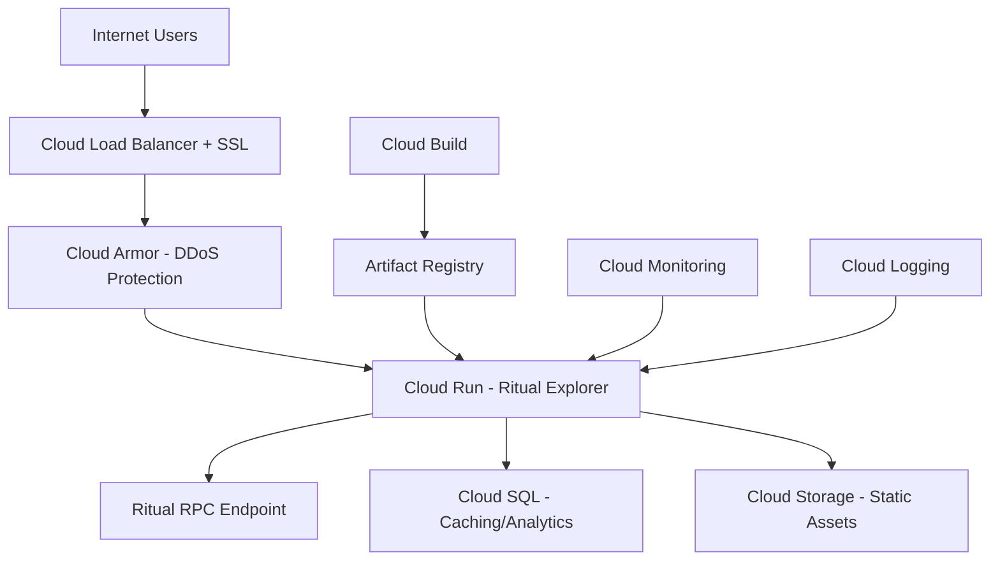

# GCP Production Deployment Strategy
## Ritual Blockchain Explorer

###  **DEPLOYMENT ARCHITECTURE OVERVIEW**



##  **PHASE 1: CORE INFRASTRUCTURE**

### **Option A: Cloud Run (Recommended for Quick Deploy)**
**Best for**: Fast deployment, auto-scaling, cost-effective

```bash
# 1. Build and push container
gcloud builds submit --tag gcr.io/PROJECT_ID/ritual-explorer .

# 2. Deploy to Cloud Run
gcloud run deploy ritual-explorer \
  --image gcr.io/PROJECT_ID/ritual-explorer \
  --platform managed \
  --region us-central1 \
  --allow-unauthenticated \
  --memory 2Gi \
  --cpu 2 \
  --concurrency 100 \
  --max-instances 10 \
  --port 3000 \
  --set-env-vars NEXT_PUBLIC_RETH_RPC_URL=http://YOUR_RPC_URL:8545 \
  --set-env-vars NEXT_PUBLIC_RETH_WS_URL=ws://YOUR_RPC_URL:8546
```

### **Option B: GKE (Recommended for Enterprise)**
**Best for**: High availability, complex networking, enterprise features

```bash
# 1. Create GKE cluster
gcloud container clusters create ritual-explorer-cluster \
  --zone us-central1-a \
  --num-nodes 3 \
  --machine-type n1-standard-2 \
  --enable-autoscaling \
  --min-nodes 1 \
  --max-nodes 10 \
  --enable-autorepair \
  --enable-autoupgrade

# 2. Apply Kubernetes manifests (using existing k8s/deployment.yaml)
kubectl apply -f k8s/deployment.yaml
```

##  **PHASE 2: ENHANCED GCP CONFIGURATION**

### **A. Cloud Build CI/CD Pipeline**

```yaml
# cloudbuild.yaml
steps:
  # Build the container image
  - name: 'gcr.io/cloud-builders/docker'
    args: ['build', '-t', 'gcr.io/$PROJECT_ID/ritual-explorer:$COMMIT_SHA', '.']
  
  # Push the container image to Container Registry
  - name: 'gcr.io/cloud-builders/docker'
    args: ['push', 'gcr.io/$PROJECT_ID/ritual-explorer:$COMMIT_SHA']
  
  # Deploy to Cloud Run
  - name: 'gcr.io/google.com/cloudsdktool/cloud-sdk'
    entrypoint: gcloud
    args:
    - 'run'
    - 'deploy'
    - 'ritual-explorer'
    - '--image'
    - 'gcr.io/$PROJECT_ID/ritual-explorer:$COMMIT_SHA'
    - '--region'
    - 'us-central1'
    - '--platform'
    - 'managed'
    - '--allow-unauthenticated'

substitutions:
  _SERVICE_NAME: ritual-explorer
  _REGION: us-central1

options:
  logging: CLOUD_LOGGING_ONLY
```

### **B. Environment Configuration**

```bash
# Create secrets in Secret Manager
gcloud secrets create ritual-rpc-url --data-file=-
gcloud secrets create ritual-ws-url --data-file=-

# For Cloud Run
gcloud run services update ritual-explorer \
  --update-secrets=RITUAL_RPC_URL=ritual-rpc-url:latest \
  --update-secrets=RITUAL_WS_URL=ritual-ws-url:latest
```

### **C. Load Balancer + SSL Setup**

```bash
# Reserve external IP
gcloud compute addresses create ritual-explorer-ip --global

# Create managed SSL certificate
gcloud compute ssl-certificates create ritual-explorer-ssl \
  --domains=ritual-explorer.your-domain.com

# Create load balancer (automated via Cloud Run domain mapping)
gcloud run domain-mappings create \
  --service ritual-explorer \
  --domain ritual-explorer.your-domain.com
```

## 🛡 **PHASE 3: SECURITY & PERFORMANCE**

### **A. Cloud Armor DDoS Protection**

```bash
# Create security policy
gcloud compute security-policies create ritual-explorer-policy \
  --description "Security policy for Ritual Explorer"

# Add rate limiting rule
gcloud compute security-policies rules create 1000 \
  --security-policy ritual-explorer-policy \
  --expression "true" \
  --action "rate-based-ban" \
  --rate-limit-threshold-count 100 \
  --rate-limit-threshold-interval-sec 60 \
  --ban-duration-sec 600
```

### **B. CDN Configuration**

```bash
# Enable Cloud CDN for static assets
gcloud compute backend-services update ritual-explorer-backend \
  --enable-cdn \
  --cache-mode CACHE_ALL_STATIC \
  --default-ttl 3600
```

### **C. Monitoring & Alerting**

```bash
# Create uptime check
gcloud alpha monitoring uptime create ritual-explorer-uptime \
  --display-name "Ritual Explorer Uptime" \
  --http-check-path "/" \
  --hostname ritual-explorer.your-domain.com

# Create alerting policy
gcloud alpha monitoring policies create \
  --display-name "Ritual Explorer Down" \
  --condition-filter 'resource.type="uptime_url"' \
  --condition-comparison COMPARISON_EQUAL \
  --condition-threshold-value 1
```

##  **PHASE 4: PERFORMANCE OPTIMIZATION**

### **A. Cloud SQL for Analytics Caching**

```sql
-- Create analytics cache table
CREATE TABLE IF NOT EXISTS analytics_cache (
  id SERIAL PRIMARY KEY,
  cache_key VARCHAR(255) UNIQUE,
  data JSONB,
  expires_at TIMESTAMP,
  created_at TIMESTAMP DEFAULT CURRENT_TIMESTAMP
);

-- Index for fast lookups
CREATE INDEX idx_analytics_cache_key ON analytics_cache(cache_key);
CREATE INDEX idx_analytics_expires ON analytics_cache(expires_at);
```

### **B. Redis for Session/WebSocket Management**

```bash
# Create Memorystore Redis instance
gcloud redis instances create ritual-explorer-redis \
  --size=1 \
  --region=us-central1 \
  --redis-version=redis_6_x
```

##  **DEPLOYMENT SCRIPTS**

### **Quick Deploy Script**

```bash
#!/bin/bash
# deploy.sh

PROJECT_ID="your-project-id"
SERVICE_NAME="ritual-explorer"
REGION="us-central1"

echo " Deploying Ritual Explorer to GCP..."

# Build and deploy
gcloud builds submit --tag gcr.io/${PROJECT_ID}/${SERVICE_NAME} .

gcloud run deploy ${SERVICE_NAME} \
  --image gcr.io/${PROJECT_ID}/${SERVICE_NAME} \
  --platform managed \
  --region ${REGION} \
  --allow-unauthenticated \
  --memory 2Gi \
  --cpu 2 \
  --max-instances 10 \
  --set-env-vars NODE_ENV=production

echo " Deployment complete!"
echo " Access your app at: $(gcloud run services describe ${SERVICE_NAME} --region=${REGION} --format='value(status.url)')"
```

### **Environment Setup Script**

```bash
#!/bin/bash
# setup-gcp.sh

PROJECT_ID=$1
if [ -z "$PROJECT_ID" ]; then
  echo "Usage: ./setup-gcp.sh PROJECT_ID"
  exit 1
fi

echo " Setting up GCP project: $PROJECT_ID"

# Enable required APIs
gcloud services enable run.googleapis.com
gcloud services enable cloudbuild.googleapis.com
gcloud services enable containerregistry.googleapis.com
gcloud services enable secretmanager.googleapis.com
gcloud services enable sql-component.googleapis.com
gcloud services enable redis.googleapis.com

# Set default project
gcloud config set project $PROJECT_ID

echo " GCP setup complete!"
```

## 💰 **COST OPTIMIZATION**

### **Estimated Monthly Costs (US-Central1)**

| Component | Configuration | Monthly Cost |
|-----------|---------------|--------------|
| **Cloud Run** | 2GB RAM, 2 vCPU, 100K requests | $15-30 |
| **Cloud Build** | 100 builds/month | $1 |
| **Container Registry** | 5GB storage | $1 |
| **Cloud SQL** | db-f1-micro (optional) | $7 |
| **Load Balancer** | Global LB + SSL | $20 |
| **Cloud CDN** | 100GB egress | $8 |
| **Monitoring** | Basic alerting | Free |

**Total Estimated Cost: $52-67/month**

### **Cost Optimization Tips**

1. **Use Cloud Run** instead of GKE for lower costs
2. **Enable request-based scaling** to scale to zero
3. **Implement caching** to reduce RPC calls
4. **Use Cloud CDN** for static assets
5. **Set up budget alerts** to monitor spending

##  **RECOMMENDED DEPLOYMENT SEQUENCE**

### **Phase 1: MVP (Day 1)**
```bash
./setup-gcp.sh YOUR_PROJECT_ID
./deploy.sh
# Result: Working app at https://SERVICE_URL/
```

### **Phase 2: Production (Week 1)**
- Custom domain + SSL
- Cloud Armor security
- Monitoring & alerting
- Basic caching

### **Phase 3: Scale (Month 1)**  
- Cloud SQL analytics caching
- Redis for WebSocket scaling
- Advanced monitoring
- Performance optimization

## 📋 **PRE-DEPLOYMENT CHECKLIST**

- [ ] **RPC Endpoint**: Ensure Ritual node is accessible from GCP
- [ ] **Domain**: Register domain for production
- [ ] **SSL Certificate**: Set up managed SSL
- [ ] **Environment Variables**: Configure all required env vars
- [ ] **Health Checks**: Verify `/api/health` endpoint works
- [ ] **Testing**: Test all 11 contract types work correctly
- [ ] **Monitoring**: Set up uptime and error monitoring
- [ ] **Backup**: Ensure RPC endpoint has redundancy

##  **USEFUL COMMANDS**

```bash
# Check deployment status
gcloud run services describe ritual-explorer --region=us-central1

# View logs
gcloud logs read "resource.type=cloud_run_revision" --limit=50

# Scale up/down
gcloud run services update ritual-explorer --max-instances=20

# Roll back deployment
gcloud run services replace-traffic ritual-explorer --to-revisions=REVISION_NAME=100
```

This deployment strategy ensures your Ritual Explorer is **production-ready**, **scalable**, and **cost-effective** while leveraging GCP's managed services for reliability and security! 
