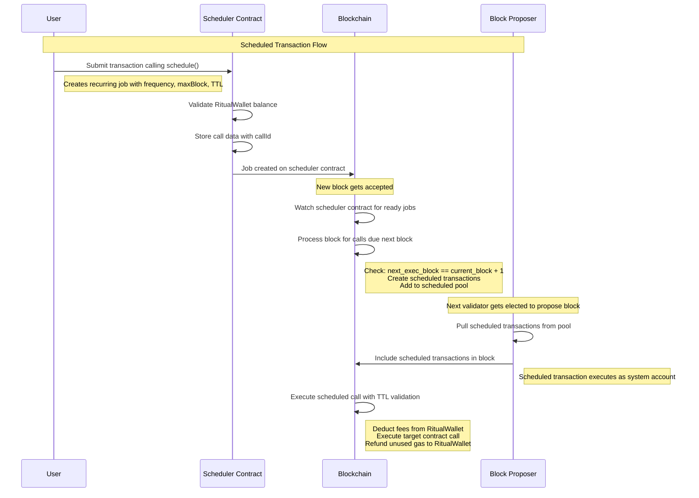
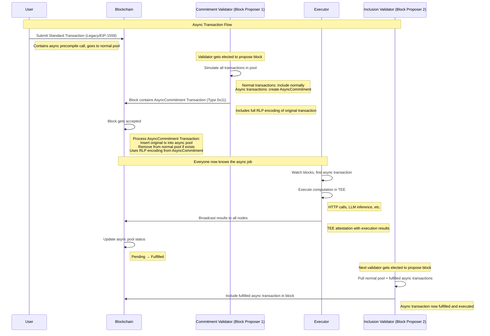
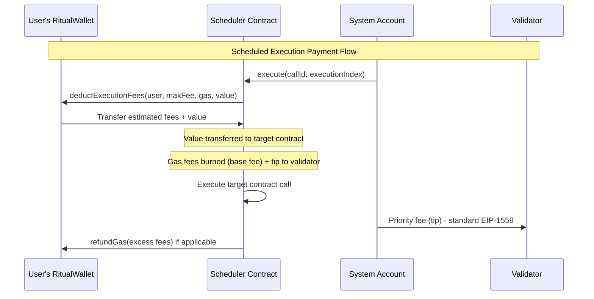
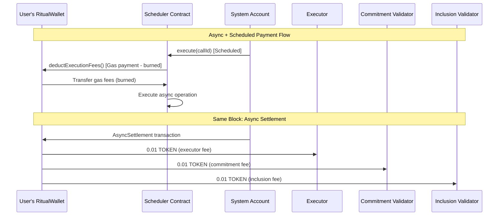

# Ritual Chain Indexer & Analytics Integration Guide

This guide is a standalone, implementation-ready guide for data indexers and analytics platforms integrating with the Ritual Chain. It describes the exact deltas from a canonical EVM L1, the schemas you must capture, recommended warehouse models, ingestion strategies, and example queries.

## Table of Contents

---

## 1. Overview

Ritual Chain is EVM-compatible and supports standard Ethereum RPCs and schemas. It introduces three system transaction types and a small set of new fields that appear in block transactions and receipts when asynchronous execution is used.

Key goals for analytics/indexers:

- Capture standard blocks/txs/receipts/logs as usual.
- Capture Ritual-specific fields and system transactions.
- Model relationships between user transactions and their async system companions.
- Attribute value flows correctly (scheduled vs async).

---

## 2. Delta vs Canonical EVM L1

What’s new compared to a typical EVM L1:

- New transaction types:
    - `0x10`: Scheduled (system transaction)
    - `0x11`: AsyncCommitment (system transaction)
    - `0x12`: AsyncSettlement (system transaction)
- Async-aware user transactions (legacy `0x00` or EIP-1559 `0x02`) can include:
    - `spcCalls[]`: special precompile call records
    - `commitmentTx`: bytes32 (links to `AsyncCommitment`)
    - `settlementTx`: bytes32 (links to `AsyncSettlement`)
- System sender addresses with validation exemptions:
    - Scheduled sender: `0x000000000000000000000000000000000000fa7e`
    - AsyncCommitment sender: `0x000000000000000000000000000000000000fa8e`
    - AsyncSettlement sender: `0x000000000000000000000000000000000000fa9e`

### 2.1 System Account Validation Exemptions

### Nonce Validation Exemptions

- Scheduled Transactions (Type `0x10`): Always use nonce `0`
- AsyncCommitment Transactions (Type `0x11`): Always use nonce `0`
- AsyncSettlement Transactions (Type `0x12`): Always use nonce `0`

### Balance Validation Exemptions

- `0x000000000000000000000000000000000000fa7e` (`Scheduled` sender)
- `0x000000000000000000000000000000000000fa8e` (`AsyncCommitment` sender)
- `0x000000000000000000000000000000000000fa9e` (`AsyncSettlement` sender)

### Gas Accounting Exemptions

- System accounts consume gas in blocks, but are balance-exempt.
- Attribute economic cost to the user’s `RitualWallet` when applicable (e.g., scheduled executions).

---

## 3. Data Sources and RPC Methods

Core RPCs (compatible with Geth/Erigon):

- Blocks/txs/receipts/logs: `eth_getBlockByNumber`, `eth_getBlockByHash`, `eth_getTransactionByHash`, `eth_getTransactionReceipt`, `eth_getLogs`, `eth_getFilterChanges`
- Tracing: `debug_traceTransaction` (`callTracer`), `trace_replayBlockTransactions`([“trace”,“stateDiff”])
- Mempool (standard): `txpool_content`

Ritual additions (txpool namespace, JSON-RPC over HTTP/WS):

- `txpool_scheduledContent`
    - Returns: `{ "scheduled": Transaction[] }`
- `txpool_AsyncCommitmentContent`
    - Returns: `{ "asyncCommitment": AsyncCommitmentTxDetails[] }`

Finality:

- BFT-style instant finality. Once a tx is included, it is final under normal operation. Indexers can process blocks immediately without reorg handling.

---

## 4. Transaction and Receipt Schemas (Authoritative)

All numeric quantities follow standard Ethereum JSON-RPC conventions (hex-encoded where applicable). Field casing is `camelCase`.

### 4.1 Async Transactions (standard user tx: `0x00` legacy or `0x02` EIP-1559)

Block transaction (when async precompiles are invoked):

```json
{
  "type": "0x0|0x2",
  "chainId": "hex_uint64",
  "nonce": "hex_uint64",
  "gas": "hex_uint64",
  "gasPrice": "hex_uint256",
  "maxFeePerGas": "hex_uint256",
  "maxPriorityFeePerGas": "hex_uint256",
  "to": "address",
  "value": "hex_uint256",
  "accessList": "AccessList[]",
  "input": "hex_bytes",
  "commitmentTx": "bytes32",
  "settlementTx": "bytes32",
  "spcCalls": [
    {
      "address": "address",
      "input": "hex_bytes",
      "output": "hex_bytes",
      "proof": "hex_bytes",
      "blockNumber": "uint64",
      "programCounter": "uint64",
      "callerAddress": "address"
    }
  ],
  "r": "hex_uint256",
  "s": "hex_uint256",
  "yParity": "0x0|0x1",
  "v": "hex_uint64",
  "hash": "bytes32",
  "blockHash": "bytes32",
  "blockNumber": "hex_uint256",
  "transactionIndex": "hex_uint256",
  "from": "address"
}
```

Notes:

- If no async precompile calls are made, the fields `spcCalls`, `commitmentTx`, and `settlementTx` are omitted.

Receipt (when async precompiles are invoked):

```json
{
  "type": "0x2",
  "status": "hex_uint64",
  "cumulativeGasUsed": "hex_uint64",
  "logs": "Log[]",
  "logsBloom": "bytes256",
  "transactionHash": "bytes32",
  "transactionIndex": "hex_uint64",
  "blockHash": "bytes32",
  "blockNumber": "hex_uint64",
  "gasUsed": "hex_uint64",
  "effectiveGasPrice": "hex_uint256",
  "from": "address",
  "to": "address",
  "contractAddress": "address|null",
  "spcCalls": [
    {
      "address": "address",
      "input": "hex_bytes",
      "output": "hex_bytes",
      "proof": "hex_bytes",
      "blockNumber": "uint64",
      "programCounter": "uint64",
      "callerAddress": "address"
    }
  ],
  "settlementTx": "bytes32",
  "commitmentTx": "bytes32"
}
```

### 4.2 Scheduled Transactions (`0x10`)

Scheduled transactions enable cron-like execution. They originate from a system account and are also accessible via a dedicated scheduled pool.

Scheduled pool response (`txpool_scheduledContent`):

```json
{
  "scheduled": [
    {
      "type": "0x10",
      "gas": "uint64",
      "gasPrice": "hex_uint256",
      "to": "address|null",
      "value": "hex_uint256",
      "input": "hex_bytes",
      "originTx": "bytes32",
      "callId": "uint64",
      "index": "uint64",
      "maxBlock": "uint64",
      "initialBlock": "uint64",
      "frequency": "uint64",
      "r": "0x0",
      "s": "0x0",
      "yParity": "0x0",
      "v": "0x0",
      "hash": "bytes32",
      "blockHash": null,
      "blockNumber": null,
      "transactionIndex": null,
      "from": "0x000000000000000000000000000000000000fa7e"
    }
  ]
}
```

Notes:

- `spcCalls`, `commitmentTx`, and `settlementTx` never appear in pool responses; they may appear in block/receipt when the scheduled call itself performs async operations.

Block transaction:

```json
{
  "type": "0x10",
  "gas": "uint64",
  "maxFeePerGas": "hex_uint256",
  "maxPriorityFeePerGas": "hex_uint256",
  "to": "address|null",
  "value": "hex_uint256",
  "input": "hex_bytes",
  "originTx": "bytes32",
  "callId": "uint64",
  "index": "uint64",
  "maxBlock": "uint64",
  "initialBlock": "uint64",
  "frequency": "uint64",
  "ttl": "uint64",
  "caller": "address",
  "r": "0x0",
  "s": "0x0",
  "yParity": "0x0",
  "v": "0x0",
  "hash": "bytes32",
  "blockHash": "bytes32",
  "blockNumber": "hex_uint256",
  "transactionIndex": "hex_uint256",
  "from": "0x000000000000000000000000000000000000fa7e",
  "gasPrice": "hex_uint256"
}
```

Receipt:

```json
{
  "type": "0x10",
  "status": "hex_uint64",
  "cumulativeGasUsed": "hex_uint64",
  "logs": "Log[]",
  "logsBloom": "bytes256",
  "transactionHash": "bytes32",
  "transactionIndex": "hex_uint64",
  "blockHash": "bytes32",
  "blockNumber": "hex_uint64",
  "gasUsed": "hex_uint64",
  "effectiveGasPrice": "hex_uint256",
  "from": "address",
  "to": "address|null",
  "contractAddress": "address|null",
  "originTx": "bytes32",
  "callId": "hex_uint64",
  "index": "hex_uint64",
  "initialBlock": "hex_uint64",
  "frequency": "hex_uint64",
  "maxBlock": "hex_uint64",
  "ttl": "hex_uint64",
  "caller": "address",
  "gas": "hex_uint64",
  "maxFeePerGas": "hex_uint256",
  "maxPriorityFeePerGas": "hex_uint256",
  "value": "hex_uint256",
  "spcCalls": "SpcCall[]"
}
```

**Scheduled Transaction Field Explanations**:

- **`originTx`**: Hash of the original transaction that scheduled this job
- **`callId`**: Unique identifier for this scheduled job (each scheduled job gets its own callId)
- **`index`**: Index of this specific execution within the scheduled job sequence (starts at 0)
    - Example: Job scheduled every 2 blocks for max 10 blocks → 5 executions with indices 0, 1, 2, 3, 4
- **`maxBlock`**: Maximum block number where this scheduled job can execute
- **`initialBlock`**: Block number where the original scheduling transaction was included
    - First scheduled execution occurs at: `initialBlock + frequency`
- **`frequency`**: How often (in blocks) this job should execute
- **`ttl`**: Time-to-live - maximum drift allowed from target block before transaction is dropped
    - Scheduled transactions are guaranteed to enter mempool at target block but not guaranteed inclusion due to block limits
    - TTL defines maximum acceptable delay from intended execution block
- **`caller`**: Address of the original user who created the scheduled job

**Key Receipt Fields**:

- **spcCalls**: Detailed information about async precompile calls including:
    - `address`: The precompile contract address (e.g., `0x0000000000000000000000000000000000000801`)
    - `input`: The encoded input data sent to the precompile
    - `output`: The response data from the precompile execution
    - `proof`: Cryptographic proof for the async execution
    - `blockNumber`: Block number when the precompile was called
    - `programCounter`: EVM program counter location of the precompile call
    - `callerAddress`: Address of the contract that made the precompile call
- **commitmentTx**: Hash of the AsyncCommitment transaction that commits to executing this async call
- **settlementTx**: Hash of the AsyncSettlement transaction that handles payment distribution

### 4.3 AsyncCommitment Transactions (`0x11`)

Block transaction:

```json
{
  "type": "0x11",
  "gas": "uint64",
  "gasPrice": "hex_uint256",
  "to": "address|null",
  "value": "hex_uint256",
  "input": "hex_bytes",
  "originTx": "bytes32",
  "originTxRlp": "hex_bytes",
  "precompileAddress": "address",
  "precompileInput": "hex_bytes",
  "commitBlock": "uint64",
  "ttl": "uint64",
  "executorAddress": "address",
  "commitmentValidator": "address",
  "programCounter": "uint64",
  "callerAddress": "address",
  "r": "0x1",
  "s": "0x2",
  "yParity": "0x0",
  "v": "0x0",
  "hash": "bytes32",
  "blockHash": "bytes32",
  "blockNumber": "hex_uint256",
  "transactionIndex": "hex_uint256",
  "from": "0x000000000000000000000000000000000000fa8e"
}
```

Receipt:

```json
{
  "type": "0x11",
  "status": "hex_uint64",
  "cumulativeGasUsed": "hex_uint64",
  "logs": "Log[]",
  "logsBloom": "bytes256",
  "transactionHash": "bytes32",
  "transactionIndex": "hex_uint64",
  "blockHash": "bytes32",
  "blockNumber": "hex_uint64",
  "gasUsed": "hex_uint64",
  "effectiveGasPrice": "hex_uint256",
  "from": "address",
  "to": "address|null",
  "contractAddress": "address|null",
  "originalTx": "bytes32",
  "precompileAddress": "address",
  "precompileInput": "hex_bytes",
  "executorAddress": "address"
}
```

**AsyncCommitment Transaction Field Explanations**:

- **`originTx`**: Hash of the original user transaction that triggered the async execution
- **`originTxRlp`**: Full RLP encoding of the original transaction to ensure all validators can reconstruct it in their async pools
- **`precompileAddress`**: Address of the async precompile contract that was called
- **`precompileInput`**: Input data that was passed to the async precompile
- **`commitBlock`**: Block number where this commitment transaction was included
- **`ttl`**: Time-to-live for the async execution (maximum blocks to wait for completion)
- **`executorAddress`**: Address of the executor node assigned to handle this async computation
- **`commitmentValidator`**: Address of the validator that created this commitment transaction
- **`programCounter`**: Program counter value at the point where the async call was made
- **`callerAddress`**: Address of the contract or account that made the async precompile call

**System Sender**: Always `0x000000000000000000000000000000000000fa8e`

### 4.4 AsyncSettlement Transactions (`0x12`)

Block transaction:

```json
{
  "type": "0x12",
  "gas": "uint64",
  "gasPrice": "hex_uint256",
  "to": "address|null",
  "value": "hex_uint256",
  "input": "hex_bytes",
  "originTx": "bytes32",
  "commitmentTx": "bytes32",
  "userAddress": "address",
  "totalAmount": "hex_uint256",
  "executorAddress": "address",
  "executorFee": "hex_uint256",
  "commitmentValidator": "address",
  "commitmentFee": "hex_uint256",
  "inclusionValidator": "address",
  "inclusionFee": "hex_uint256",
  "settlementBlock": "uint64",
  "r": "0x1",
  "s": "0x2",
  "yParity": "0x0",
  "v": "0x0",
  "hash": "bytes32",
  "blockHash": "bytes32",
  "blockNumber": "hex_uint256",
  "transactionIndex": "hex_uint256",
  "from": "0x000000000000000000000000000000000000fa9e"
}
```

Receipt:

```json
{
	"type": "0x12",
  "status": "hex_uint64",
  "cumulativeGasUsed": "hex_uint64",
  "logs": "Log[]",
  "logsBloom": "bytes256",
  "transactionHash": "bytes32",  
  "transactionIndex": "hex_uint64",  
  "blockHash": "bytes32", 
  "blockNumber": "hex_uint64", 
  "gasUsed": "hex_uint64", 
  "effectiveGasPrice": "hex_uint256", 
  "from": "address", 
  "to": "address|null", 
  "contractAddress": "address|null",
  "userAddress": "address", 
  "totalAmount": "hex_uint256",  
  "executorAddress": "address",  
  "executorFee": "hex_uint256", 
  "commitmentValidator": "address",  
  "commitmentFee": "hex_uint256",  
  "inclusionValidator": "address", 
  "inclusionFee": "hex_uint256", 
  "settlementBlock": "hex_uint64", 
  "commitmentTx": "bytes32"
}
```

**AsyncSettlement Transaction Field Explanations**:

- **`originTx`**: Hash of the original user transaction that triggered the async execution
- **`commitmentTx`**: Hash of the AsyncCommitment transaction being settled
- **`userAddress`**: Address of the user who initiated the original async transaction
- **`totalAmount`**: Total amount of TOKEN being distributed as protocol fees
- **`executorAddress`**: Address of the executor node that performed the async computation
- **`executorFee`**: Fee amount paid to the executor
- **`commitmentValidator`**: Address of the validator that created the AsyncCommitment transaction
- **`commitmentFee`**: Fee amount paid to the commitment validator
- **`inclusionValidator`**: Address of the validator that included the fulfilled async transaction
- **`inclusionFee`**: Fee amount paid to the inclusion validator
- **`settlementBlock`**: Block number where this settlement transaction was included

**System Sender**: Always `0x000000000000000000000000000000000000fa9e`

---

## 5. Transaction Flow Diagrams

### 5.1 Scheduled Transaction Flow

The following diagram illustrates how scheduled transactions flow through the system:



### Key Flow Points:

1. **Schedule Creation**: User submits transaction calling `scheduler.schedule()` with target contract, frequency, maxBlock, and TTL parameters
2. **Job Storage**: Scheduler stores call data on-chain with unique callId
3. **Block Processing**: At every block update, every node checks if scheduled jobs are meant to be included in the next block. If so, creates scheduled transactions and adds them to the scheduled pool
4. **Block Building**: Block proposer pulls scheduled transactions from pool and includes them in block if paying sufficient fees
5. **System Execution**: Scheduled transaction executes as system account (`0x000000000000000000000000000000000000fa7e`)
6. **TTL Validation**: System validates execution isn’t beyond TTL drift tolerance
    - **Drift occurs** when scheduled transactions can’t be included in their target block due to network congestion or block limits
    - **TTL (Time-to-Live)** defines maximum acceptable delay from intended execution block
    - If current block exceeds `scheduled_block + ttl`, execution is skipped to prevent stale execution
7. **Fee Processing**: RitualWallet deducts execution fees from user’s balance
8. **Target Execution**: System calls target contract with original parameters and specified gas/value
9. **Gas Refund**: Unused gas refunded to user’s RitualWallet balance

### 5.2 Async Transaction Flow

The following diagram illustrates how async transactions flow through the system:



### Key Flow Points:

1. **Standard Transaction Submission**: User submits transaction containing async precompile call (Legacy Type 0x00 or EIP-1559 Type 0x02) to blockchain, stored in normal pool
2. **Validator Election**: Next validator gets elected to propose a block
3. **Transaction Simulation**: Validator simulates every transaction in its transaction pool
4. **Block Building**:
    - **Normal transactions**: Included normally in block
    - **Async transactions**: Commitment validator creates block containing AsyncCommitment transaction (Type 0x11)
    - **Critical**: AsyncCommitment includes full RLP encoding of original transaction to ensure all validators can reconstruct the exact transaction even with inconsistent mempool views
5. **Block Acceptance & Pool Migration**: Each validator receives the block and executes all transactions:
    - For AsyncCommitment transactions: constructs the original transaction from RLP encoding and inserts it into async pool
    - If the same original transaction exists in validator’s normal pools, removes it from normal pools
    - **Important**: RLP encoding ensures all nodes can reconstruct transaction identically
6. **Async Job Recognition**: All nodes now know what async job needs to be executed
7. **Executor Monitoring**: Executor node constantly watches blocks and finds async transaction to execute
8. **TEE Execution & Broadcasting**: Executor executes transaction in TEE and broadcasts results to all blockchain nodes
9. **Pool Status Update**: All nodes update async transaction status from pending to fulfilled in their pools
10. **Next Block Proposal**: Next validator gets elected to propose a block
11. **Fulfilled Transaction Inclusion**: Validator pulls from normal pool + all fulfilled async transactions and includes them in block - async transaction is now fulfilled

### 5.3 Transaction Relationships

Index these relationships:

- User Tx → `AsyncCommitment` via `userTx.commitmentTx`
- User Tx → `AsyncSettlement` via `userTx.settlementTx`
- `AsyncCommitment` → User Tx via `originTx` / `originTxRlp`
- `AsyncSettlement` → `AsyncCommitment` via `commitmentTx`
- `Scheduled` families grouped by `originTx` + `callId`, ordered by `index`, constrained by `initialBlock`/`frequency`/`maxBlock`/`ttl`

---

## 6. Payment Mechanics and Attribution

Scheduled execution payments:

- User pre-funds `RitualWallet`.
- Scheduler deducts estimated fees via `deductExecutionFees`, burns base fee, pays tip to validator; refunds excess via `refundGas`.
- System account executes while balance-exempt; the user’s `RitualWallet` economically funds the execution.

### Scheduled Execution Payment Flow



Async settlement payments:

- Internal transfers from the user’s `RitualWallet` to three parties:
    - Executor
    - Commitment validator
    - Inclusion validator
- Amounts appear as internal TOKEN value transfers (`call traces`) and as structured fields on the `AsyncSettlement` transaction.

Indexing guidance:

- Attribute economic cost of scheduled execution to the user (`RitualWallet` → `Scheduler` transfer), not the system account.
- Attribute async protocol fees to the user via the three internal transfers in `settlement traces`.

### 6.1 Async Settlement: Actors and opcode-level mapping

- **Source of funds**: The settlement transaction’s `to` is the user’s `RitualWallet`; internal `CALL`s at depth 1 debit this wallet.
- **Transfers you should extract** (via `debug_traceTransaction` `callTracer`): three `CALL`s with non-zero `value` at depth 1, from `RitualWallet` → each recipient.
- **Structured fields mapping**:
    - `executorAddress` ↔︎ TOKEN transfer to executor; value equals `executorFee`.
    - `commitmentValidator` ↔︎ TOKEN transfer; value equals `commitmentFee`.
    - `inclusionValidator` ↔︎ TOKEN transfer; value equals `inclusionFee`.
- **Attribution**: Charge protocol fees to the user owning the `RitualWallet`; recipients earn revenue equal to fees received.

### 6.2 Scheduled Execution: user vs system accounting

- **System bookkeeping** (free to user):
    - System sender `0x…fa7e` calls `Scheduler.execute(callId, index)`.
    - These frames consume gas in the block but are not charged to the user.
- **User-funded operations**:
    - `RitualWallet.deductExecutionFees(...)` transfers TOKEN from user wallet to `Scheduler`.
    - The first `CALL` after `deductExecutionFees` (same call depth) is the user-specified callback; attribute its economic cost to the user.
    - Excess TOKEN returned via `RitualWallet.refundGas(user, amount, callId)`.
    - See [Section 9.2](about:blank#92-scheduled-transactions-complete-tracer-python) for complete Python code that demonstrates this tracing logic.
- **Tip/base fee semantics**: Standard EIP-1559; base fee burned, priority fee to validator. Economically backed by the wallet deduction, not by the system account.

### 6.3 Combined flows (async inside scheduled)

When a scheduled transaction triggers async execution, both models apply:

- Scheduled run: `Wallet` → `Scheduler` deduction backs gas and value.
- Immediate settlement: `Wallet` makes three internal transfers to protocol recipients (executor + validators) in the same block as the async transaction.

### Async + Scheduled Payment Flow



---

## 7. Recommended Warehouse Schema (Derived Tables)

Alongside canonical blocks/transactions/receipts/logs/traces tables, create the following derived tables.

- `async_calls`
    - One row per element of `spcCalls[]` on user transactions
    - Keys: (`transaction_hash`, `spc_index`)
    - Columns: `precompile_address`, `input`, `output`, `proof`, `block_number`, `pc`, `caller_address`
- `async_commitments`
    - One row per `AsyncCommitment` (`0x11`)
    - Keys: `commitment_tx_hash` (PK)
    - Columns: `origin_tx_hash`, `precompile_address`, `precompile_input`, `commit_block`, `ttl`, `executor_address`, `commitment_validator`, `program_counter`, `caller_address`
- `async_settlements`
    - One row per `AsyncSettlement` (`0x12`)
    - Keys: `settlement_tx_hash` (PK)
    - Columns: `origin_tx_hash`, `commitment_tx_hash`, `user_address`, `total_amount`, `executor_address`, `executor_fee`, `commitment_validator`, `commitment_fee`, `inclusion_validator`, `inclusion_fee`, `settlement_block`
- `scheduled_calls`
    - One row per `Scheduled` tx (`0x10`)
    - Keys: `tx_hash` (PK)
    - Columns: `origin_tx_hash`, `call_id`, `execution_index`, `initial_block`, `frequency`, `max_block`, `ttl`, `caller`
- `fees_settlement_payments`
    - Extract from `settlement traces`
    - Keys: (`settlement_tx_hash`, `leg_index`)
    - Columns: `from_address` (`RitualWallet`), `to_address`, `value_wei`
- `address_roles`
    - Classify system addresses and known precompiles
    - Rows: (`address`, `role`) e.g., (`…fa7e`, ‘system_scheduled’), (`…fa8e`, ‘system_commitment’), (`…fa9e`, ‘system_settlement’), (`0x000…0801`, ‘async_precompile’)

Notes:

- Use `camelCase` in JSON ingestion, convert to `snake_case` in warehouse if preferred.
- Store big integers as strings or `NUMERIC`/`DECIMAL` types with sufficient precision.

---

## 8. Ingestion Strategy (Backfill + Incremental)

Backfill:

1. Iterate blocks by number; for each block, pull full transactions and receipts.
2. Emit canonical rows into `blocks`/`transactions`/`receipts`/`logs`.
3. From transactions and receipts, populate derived tables (`async_calls`, `scheduled_calls`, etc.).
4. For `AsyncSettlement` and `Scheduled` txs, run `debug_traceTransaction`(`callTracer`) to materialize internal transfers (`fees_settlement_payments`).

Incremental:
- Subscribe/poll new blocks; process identically.
- Finality is instant; no reorg logic needed under normal operation.
- Optional mempool analytics:
- `txpool_scheduledContent` → surface scheduled backlog
- `txpool_AsyncCommitmentContent` → surface async commitment entries

Operational tips:
- Rate-limit tracing; batch traces via worker pools.
- Idempotent upserts keyed by `tx hash`; dedupe by primary keys suggested above.
- Normalize `hex` to `numeric` consistently; capture `raw hex` for fidelity.

---

## 9. Tracing and Internal Transfers

- Use `debug_traceTransaction` with `tracer = 'callTracer'` and `withLog=true` where supported.

Example curl:

```bash
curl -s -X POST -H 'Content-Type: application/json' --data '{    "jsonrpc":"2.0",    "method":"debug_traceTransaction",    "params":["0x<txHash>", {"tracer":"callTracer", "tracerConfig": {"withLog": true}}],    "id":1  }' http://127.0.0.1:8545
```

### 9.1 Tracing Peculiarities & Balance Attribution

Scheduled and async transactions introduce special tracing semantics because system accounts are balance-exempt. Indexers must take care to attribute value transfers and gas costs correctly.

### AsyncSettlement Transactions (0x12)

**Traces**: Settlement logic emits CALL opcodes with value > 0 directly from the user’s RitualWallet to executor, commitment validator, and inclusion validator.

**Indexer Guidance**: Treat these like any other internal token transfers. Balances reconcile normally.

### Scheduled Transactions (0x10)

### System vs User Operations

Scheduled transactions are submitted by the system account (`0x000000000000000000000000000000000000fa7e`), but the economic cost is paid by the user through their RitualWallet contract. This creates a mixed execution model where indexers must distinguish between system bookkeeping and user-funded operations.

### Call Structure & Economic Attribution

1. System Account → Scheduler: `execute(callId, executionIndex)` - System bookkeeping (free)
2. Scheduler → RitualWallet: `deductExecutionFees(...)` - User pays estimated costs
3. Scheduler → Target Contract: User-specified callback - User-funded execution
4. Scheduler → RitualWallet: `refundGas(...)` - User receives refund (if applicable)

**Key Insight**: The user-specified callback is always the first CALL operation after `deductExecutionFees` at the same call tree level. This allows indexers to programmatically separate system operations from user-funded contract execution.

### Indexer Implementation

1. Identify user operations: Parse traces to find the first CALL after `deductExecutionFees`.
2. Attribute costs correctly: The amount deducted from the RitualWallet funds the user callback and EIP-1559 base/tip.

### 9.2 Scheduled Transactions: Complete Tracer (Python)

The following script is copied verbatim from the scanner integration guide. It identifies user vs system operations and prints a cast-style call tree with value transfers:

```python

"""
Scheduled Transaction Tracer

This script executes a scheduled transaction and provides detailed tracing
visualization similar to `cast run`, showing all contract calls and value transfers.

Usage:
    python trace_scheduled_transaction.py --hash 0x123...   # Trace existing transaction
"""

import argparse
import asyncio
from dataclasses import dataclass
from decimal import Decimal
from typing import Any, Dict, List, Optional

from blockchain.web3_client import InstrumentedWeb3Client
from ritual_common.contract_addresses import (
    RITUAL_WALLET_CONTRACT_ADDRESS,
    SCHEDULED_CONSUMER_CONTRACT_ADDRESS,
    SCHEDULER_CONTRACT_ADDRESS,
)
from utils.logging import get_logger

logger = get_logger(__name__)

@dataclass
class CallFrame:
    """Represents a single call frame in the trace"""

    type: str  # CALL, STATICCALL, DELEGATECALL, CREATE, etc.
    from_addr: str
    to_addr: str
    value: int
    gas: int
    gas_used: int
    input: str
    output: str
    error: Optional[str]
    calls: List["CallFrame"]
    depth: int

class ScheduledTransactionTracer:
    def __init__(self):
        self.web3_client = None

    async def initialize(self):
        """Initialize web3 client"""
        self.web3_client = InstrumentedWeb3Client("http://127.0.0.1:8545")
        await self.web3_client.initialize()

    async def trace_transaction(self, tx_hash: str) -> Dict[str, Any]:
        """Get detailed trace of a transaction using debug_traceTransaction"""
        logger.info(f"🔍 Tracing transaction: {tx_hash}")

        try:
            # Use callTracer to get structured call tree
            trace_result = await self.web3_client.web3.manager.coro_request(
                "debug_traceTransaction",
                [tx_hash, {"tracer": "callTracer", "tracerConfig": {"withLog": True}}],
            )

            return trace_result
        except Exception as e:
            logger.error(f"Error tracing transaction: {e}")
            return {}

    def parse_trace_to_frames(self, trace_data: Dict[str, Any], depth: int = 0) -> CallFrame:
        """Parse trace data into structured CallFrame objects"""
        frame = CallFrame(
            type=trace_data.get("type", "UNKNOWN"),
            from_addr=trace_data.get("from", ""),
            to_addr=trace_data.get("to", ""),
            value=int(trace_data.get("value", "0x0"), 16),
            gas=int(trace_data.get("gas", "0x0"), 16),
            gas_used=int(trace_data.get("gasUsed", "0x0"), 16),
            input=trace_data.get("input", ""),
            output=trace_data.get("output", ""),
            error=trace_data.get("error"),
            calls=[],
            depth=depth,
        )

        # Parse nested calls
        if "calls" in trace_data:
            for call_data in trace_data["calls"]:
                frame.calls.append(self.parse_trace_to_frames(call_data, depth + 1))

        return frame

    def format_address(self, addr: str) -> str:
        """Format address with known contract names"""
        addr_lower = addr.lower()

        if addr_lower == SCHEDULER_CONTRACT_ADDRESS.lower():
            return f"Scheduler ({addr[:6]}...{addr[-4:]})"
        elif addr_lower == RITUAL_WALLET_CONTRACT_ADDRESS.lower():
            return f"RitualWallet ({addr[:6]}...{addr[-4:]})"
        elif addr_lower == SCHEDULED_CONSUMER_CONTRACT_ADDRESS.lower():
            return f"ScheduledConsumer ({addr[:6]}...{addr[-4:]})"
        elif addr_lower.endswith("fa7e"):  # System account pattern
            return f"SystemAccount ({addr[:6]}...{addr[-4:]})"
        else:
            return f"{addr[:6]}...{addr[-4:]}"

    def format_value(self, value_wei: int) -> str:
        """Format value in TOKEN with wei precision"""
        if value_wei == 0:
            return "0 TOKEN"

        token_value = Decimal(value_wei) / Decimal(10**18)
        if token_value >= Decimal("0.001"):
            return f"{token_value:.6f} TOKEN"
        else:
            return f"{value_wei} wei"

    def format_gas(self, gas: int) -> str:
        """Format gas with thousands separator"""
        return f"{gas:,}"

    def get_function_signature(self, input_data: str) -> str:
        """Extract function signature from input data"""
        if not input_data or len(input_data) < 10:
            return "fallback()"

        sig = input_data[:10]

        # Known function signatures
        signatures = {
            "0xa9059cbb": "transfer(address,uint256)",
            "0x23b872dd": "transferFrom(address,address,uint256)",
            "0x095ea7b3": "approve(address,uint256)",
            "0x70a08231": "balanceOf(address)",
            "0x5601eaea": "execute(uint256,uint256)",  # Scheduler.execute
            "0xe33d3995": "deductExecutionFees(address,uint256,uint256,uint256,uint256)",
            "0x71265eac": "refundGas(address,uint256,uint256)",  # RitualWallet.refundGas
            "0xb3c1369d": "processInference(bytes)",  # ScheduledConsumer.processInference
        }

        return signatures.get(sig, f"unknown({sig})")

    def print_call_tree(
        self,
        frame: CallFrame,
        is_last: bool = True,
        prefix: str = "",
        in_user_call: bool = False,
        is_user_callback_root: bool = False,
    ):
        """Print the call tree in a cast run style format"""
        # Determine the call symbol and prefix for this level
        if frame.depth == 0:
            symbol = "├─"
            detail_prefix = "   "
            child_prefix = "   "
        else:
            symbol = "└─" if is_last else "├─"
            detail_prefix = prefix + ("   " if is_last else "│  ")
            child_prefix = prefix + ("   " if is_last else "│  ")

        # Format the call line
        call_type = frame.type
        from_name = self.format_address(frame.from_addr)
        to_name = self.format_address(frame.to_addr)
        value_str = self.format_value(frame.value)
        gas_str = self.format_gas(frame.gas_used)
        func_sig = self.get_function_signature(frame.input)

        # Find the user callback index: the first CALL after deductExecutionFees at the same level
        user_callback_index = -1
        if frame.calls:
            fee_deduction_index = -1
            # Find deductExecutionFees call
            for i, call in enumerate(frame.calls):
                if "deductExecutionFees" in self.get_function_signature(call.input):
                    fee_deduction_index = i
                    break

            # If we found fee deduction, find the next CALL as user callback
            if fee_deduction_index >= 0:
                for i in range(fee_deduction_index + 1, len(frame.calls)):
                    if frame.calls[i].type == "CALL":
                        user_callback_index = i
                        break

        # Color coding based on call type, success, and user call status
        if frame.error:
            status = f"❌ REVERTED: {frame.error}"
            call_color = "\033[91m"  # Red for main call line
            detail_color = "\033[91m"  # Red for details too
        else:
            status = "✅ SUCCESS"
            if in_user_call:
                call_color = "\033[96m"  # Cyan for user call line
                detail_color = "\033[96m"  # Cyan for user details
            else:
                call_color = "\033[92m"  # Green for scheduler call line
                detail_color = ""  # White (no color) for scheduler details

        reset_color = "\033[0m"

        # Main call line
        print(f"{prefix}{symbol} {call_color}{call_type}{reset_color}: {from_name} → {to_name}")

        # Format function display - show raw selector only for the exact user callback call
        if is_user_callback_root and len(frame.input) >= 10:
            raw_selector = frame.input[:10]
            function_display = f"{raw_selector} (user-specified callback)"
        else:
            function_display = func_sig

        # Print call details with proper indentation
        if frame.calls:
            # If there are child calls, show details with continuation lines
            print(f"{detail_prefix}├─ {detail_color}Function: {function_display}{reset_color}")
            print(f"{detail_prefix}├─ {detail_color}Value: {value_str}{reset_color}")
            print(f"{detail_prefix}├─ {detail_color}Gas Used: {gas_str}{reset_color}")
            print(f"{detail_prefix}├─ {detail_color}Status: {status}{reset_color}")
        else:
            # If no child calls, use terminal lines
            print(f"{detail_prefix}├─ {detail_color}Function: {function_display}{reset_color}")
            print(f"{detail_prefix}├─ {detail_color}Value: {value_str}{reset_color}")
            print(f"{detail_prefix}├─ {detail_color}Gas Used: {gas_str}{reset_color}")
            print(f"{detail_prefix}└─ {detail_color}Status: {status}{reset_color}")

        # Print nested calls
        for i, call in enumerate(frame.calls):
            is_last_child = i == len(frame.calls) - 1

            # Only color this call cyan if it's the exact user callback or we're already
            # inside user call tree
            child_in_user_call = (i == user_callback_index) or (
                in_user_call and user_callback_index == -1
            )
            child_is_user_callback_root = i == user_callback_index

            self.print_call_tree(
                call, is_last_child, child_prefix, child_in_user_call, child_is_user_callback_root
            )

    async def trace_existing_transaction(self, tx_hash: str):
        """Trace an existing transaction by hash"""
        print("🎬 SCHEDULED TRANSACTION TRACER")
        print("=" * 80)
        print(f"Tracing existing transaction: {tx_hash}")

        # Trace the transaction
        trace_data = await self.trace_transaction(tx_hash)

        if not trace_data:
            logger.error("❌ Could not get trace data")
            return

        # Parse and display the trace
        print("\n" + "=" * 80)
        print("🔍 TRANSACTION CALL TRACE")
        print("=" * 80)
        print(f"Transaction Hash: {tx_hash}")
        print(f"Block Number: {trace_data.get('blockNumber', 'Unknown')}")
        print("-" * 80)

        root_frame = self.parse_trace_to_frames(trace_data)
        self.print_call_tree(root_frame)

        print("\n" + "=" * 80)
        print("✅ TRACE ANALYSIS COMPLETE")
        print("=" * 80)

async def main():
    """Main entry point"""
    parser = argparse.ArgumentParser(description="Trace scheduled transactions")
    parser.add_argument("--hash", required=True, help="Transaction hash to trace")
    args = parser.parse_args()

    tracer = ScheduledTransactionTracer()
    await tracer.initialize()

    await tracer.trace_existing_transaction(args.hash)

if __name__ == "__main__":
    asyncio.run(main())
```

Sample output screenshot:


Scheduled Transaction Trace Output

### 9.2 Async Settlement: Internal TOKEN transfers

You should see three depth-1 CALLs from the user’s RitualWallet to the executor and validators. Example extraction logic (JavaScript):

```jsx
// Get settlement transaction trace (same as any internal transaction indexing)const trace = await web3.debug.traceTransaction(settlementTxHash, {
  tracer: "callTracer"});// Parse internal calls recursively (your existing logic)function extractBalanceTransfers(trace, depth = 0) {
  const transfers = [];  // Look for CALL operations with TOKEN value (same as standard internal txs)  if (trace.type === "CALL" && trace.value !== "0x0") {
    transfers.push({
      from: trace.from,      to: trace.to,      value: parseInt(trace.value, 16),      depth: depth
    });  }
  // Process nested calls  if (trace.calls) {
    for (const call of trace.calls) {
      transfers.push(...extractBalanceTransfers(call, depth + 1));    }
  }
  return transfers;}
const balanceTransfers = extractBalanceTransfers(trace);
```

Expected pattern at depth 1:

- RitualWallet → `executorAddress` for `executorFee`
- RitualWallet → `commitmentValidator` for `commitmentFee`
- RitualWallet → `inclusionValidator` for `inclusionFee`

---

## 10. Example Analytics Queries

Top executors by earned fees (generic SQL):

```sql
SELECT executor_address, SUM(executor_fee) AS total_executor_fee
FROM async_settlements
GROUP BY 1ORDER BY total_executor_fee DESCLIMIT 50;
```

Async adoption over time:

```sql
SELECT DATE_TRUNC('day', b.timestamp) AS day,
       COUNTIF(t.spcCalls IS NOT NULL AND CARDINALITY(t.spcCalls) > 0) AS async_txs,
       COUNT(*) AS total_txs,
       SAFE_DIVIDE(
         COUNTIF(t.spcCalls IS NOT NULL AND CARDINALITY(t.spcCalls) > 0),
         COUNT(*)
       ) AS async_ratio
FROM transactions t
JOIN blocks b ON b.hash = t.block_hash
GROUP BY 1ORDER BY 1;
```

Time-to-settlement distribution:

```sql
SELECT s.settlement_block - tx.block_number AS blocks_to_settle,
       COUNT(*) AS tx_count
FROM async_settlements s
JOIN transactions tx ON tx.hash = s.origin_tx_hash
GROUP BY 1ORDER BY 1;
```

Scheduled job cadence compliance:

```sql
SELECT origin_tx_hash,
       MIN(block_number) AS first_exec,
       MAX(block_number) AS last_exec,
       COUNT(*) AS executions,
       ANY_VALUE(frequency) AS freq
FROM scheduled_calls
GROUP BY origin_tx_hash;
```

Most-used async precompiles:

```sql
SELECT precompile_address, COUNT(*) AS calls
FROM async_calls
GROUP BY precompile_address
ORDER BY calls DESCLIMIT 20;
```

---

## 11. Operational Notes (Finality, Types, Casing)

- Finality: BFT instant finality; treat blocks as final upon inclusion.
- Field casing: camelCase in RPC JSON; convert as needed for warehouse conventions.
- Numeric types: hex-encoded quantities; normalize to integer/decimal types with sufficient precision.
- Addresses: checksum recommended for display; store lowercased for joins.
- Absent vs null: Some fields are omitted when not applicable (e.g., spcCalls on non-async txs). Handle both null and missing.